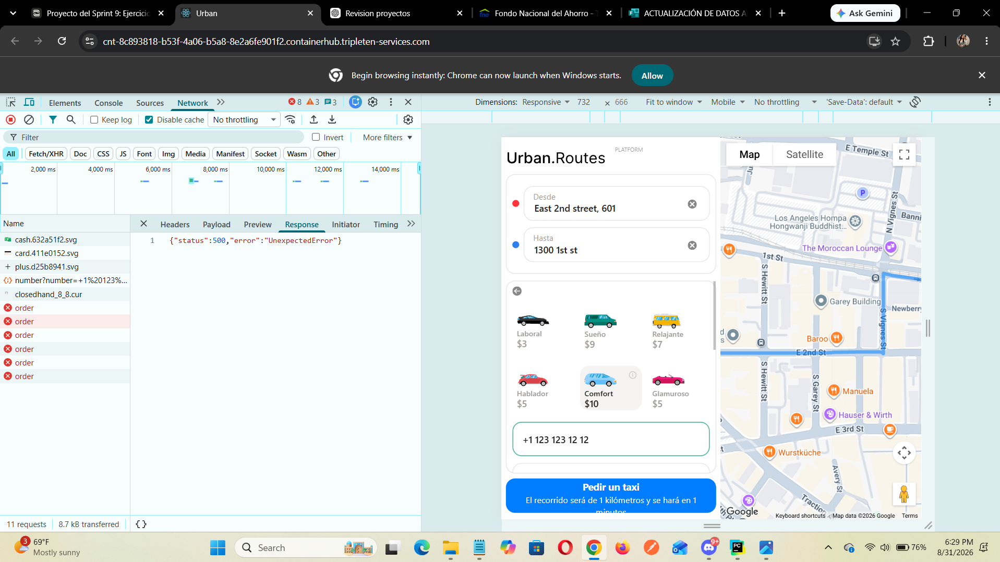

# Urban Routes UI Test Automation

## Project Description

This project contains automated UI tests for the Urban Routes web application. The tests validate the main flow for requesting a taxi, including setting a route, selecting the Comfort tariff, adding a phone number and credit card, sending a message to the driver, selecting additional ride options, and requesting a taxi.

The project uses the Page Object Model (POM) to separate page locators and interaction methods from the test scenarios.

## Technologies and Techniques

- Python
- Pytest
- Selenium WebDriver
- Page Object Model (POM)
- CSS, XPath, ID, and Class Name locators
- Explicit waits with WebDriverWait
- Automated assertions

## Automated Test Scenarios

The project includes 9 automated test scenarios:

1. Set the origin and destination route
2. Select the Comfort tariff
3. Add and confirm a phone number
4. Add a credit card
5. Add a message for the driver
6. Select blankets and tissues
7. Add two ice creams
8. Request a taxi
9. Verify that driver information is displayed

## Project Structure

- `data/` – Test data and Urban Routes URL
- `pages/` – Page Object Model locators and interaction methods
- `tests/` – Automated test scenarios
- `helpers/` – Helper provided for retrieving the phone confirmation code
- `requirements.txt` – Project dependencies

## Running the Tests

1. Open the project in PyCharm.
2. Install the dependencies listed in `requirements.txt`.
3. Update the Urban Routes URL in `data/data.py` if necessary.
4. Open `tests/test_urban_routes.py`.
5. Run the tests using PyCharm.

## Test 9 – Known Application Issue

Test 9 verifies that driver information is displayed after requesting a taxi.

During test execution, the application returned an HTTP 500 `UnexpectedError` when the taxi order was submitted. Because of this application error, the test could not reach the state where the driver information is displayed.

The screenshot below shows the server response observed during testing:

!
